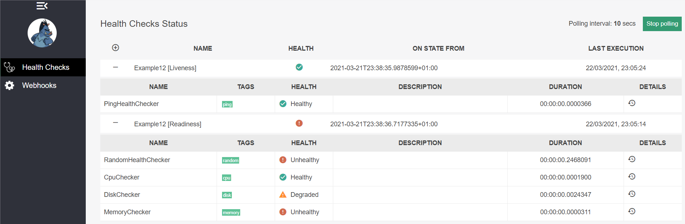
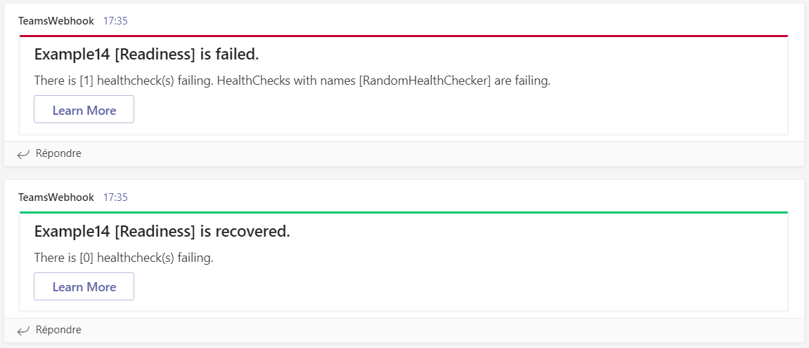

[](https://github.com/aimenux/HealthChecksDemo/actions/workflows/ci.yml)

# HealthChecksDemo
```
Exploring healthchecks capabilities with .net 5.0
```
>
> In this repo, i m providing multiple ways of adding healthchecks support to web api net 5
>
> :writing_hand: `Example01`
>
>> 2 uri checkers
>>
>> 1 endpoint accessible on `/`
>
> :writing_hand: `Example02`
>
>> 2 custom checkers
>>
>> 1 endpoint accessible on `/`
>
> :writing_hand: `Example03`
>
>> 3 custom checkers
>>
>> 4 endpoints accessibles on `/options1`, `/options2`, `/options3`, `/options4`
>
> :writing_hand: `Example04`
>
>> 5 custom checkers
>>
>> 1 endpoint accessible on `/healthchecks`
>>
>> ui (fluent config, inmemory storage) served on `/healthchecks-ui`
>
> :writing_hand: `Example05`
>
>> 5 custom checkers
>>
>> 2 endpoints accessibles on `/healthchecks/live`, `/healthchecks/ready`
>>
>> ui (fluent config, inmemory storage) served on `/healthchecks-ui`
>
> :writing_hand: `Example06`
>
>> 5 custom checkers
>>
>> 2 endpoints accessibles on `/healthchecks/live`, `/healthchecks/ready`
>>
>> ui (json config, absolute uris, inmemory storage) served on `/healthchecks-ui`
>
> :writing_hand: `Example07`
>
>> 5 custom checkers
>>
>> 2 endpoints accessibles on `/healthchecks/live`, `/healthchecks/ready`
>>
>> ui (json config, relative uris, inmemory storage) served on `/healthchecks-ui`
>
> :writing_hand: `Example08`
>
>> 5 custom checkers
>>
>> 2 endpoints accessibles on `/healthchecks/live`, `/healthchecks/ready`
>>
>> ui (json config, relative uris, sqllite storage) served on `/healthchecks-ui`
>
> :writing_hand: `Example09`
>
>> 5 custom checkers
>>
>> 2 endpoints accessibles on `/healthchecks/live`, `/healthchecks/ready`
>>
>> ui (json config, relative uris, sqlserver storage) served on `/healthchecks-ui`
>
> :writing_hand: `Example10`
>
>> 2 custom checkers
>>
>> 2 sqlserver checkers
>>
>> 2 endpoints accessibles on `/healthchecks/live`, `/healthchecks/ready`
>>
>> ui (json config, relative uris, sqlserver storage) served on `/healthchecks-ui`
>
> :writing_hand: `Example11`
>
>> 5 custom checkers
>>
>> 2 endpoints accessibles on `/healthchecks/live`, `/healthchecks/ready`
>>
>> Swagger support for healthchecks routes
>>
>> ui (json config, relative uris, sqlserver storage) served on `/healthchecks-ui`
>
> :writing_hand: `Example12`
>
>> 5 custom checkers
>>
>> 2 endpoints accessibles on `/healthchecks/live`, `/healthchecks/ready`
>>
>> 2 publishers to appinsights (metric/availability)
>>
>> Swagger support for healthchecks routes
>>
>> ui (json config, relative uris, sqlserver storage) served on `/healthchecks-ui`
>
> :writing_hand: `Example13`
>
>> 2 custom checkers
>>
>> 2 endpoints accessibles on `/healthchecks/live`, `/healthchecks/ready`
>>
>> 2 webhooks (basic fluent config) for alerts on [microsoft-teams](https://www.microsoft.com/en-ww/microsoft-teams/download-app) and [request-catcher](https://requestcatcher.com/)
>>
>> ui (fluent config, inmemory storage) served on `/healthchecks-ui`
>
> :writing_hand: `Example14`
>
>> 2 custom checkers
>>
>> 2 endpoints accessibles on `/healthchecks/live`, `/healthchecks/ready`
>>
>> 2 webhooks (advanced fluent config) for alerts on [microsoft-teams](https://www.microsoft.com/en-ww/microsoft-teams/download-app) and [request-catcher](https://requestcatcher.com/)
>>
>> ui (fluent config, inmemory storage) served on `/healthchecks-ui`
>
> :writing_hand: `Example15`
>
>> 2 custom checkers
>>
>> 2 endpoints accessibles on `/healthchecks/live`, `/healthchecks/ready`
>>
>> 2 webhooks (json config) for alerts on [microsoft-teams](https://www.microsoft.com/en-ww/microsoft-teams/download-app) and [request-catcher](https://requestcatcher.com/)
>>
>> ui (json config, inmemory storage) served on `/healthchecks-ui`
>
>
> 
>
>
> 
>
>
> 
>

**`Tools`** : vs19, webapi, net 5.0, healthchecks, serilog